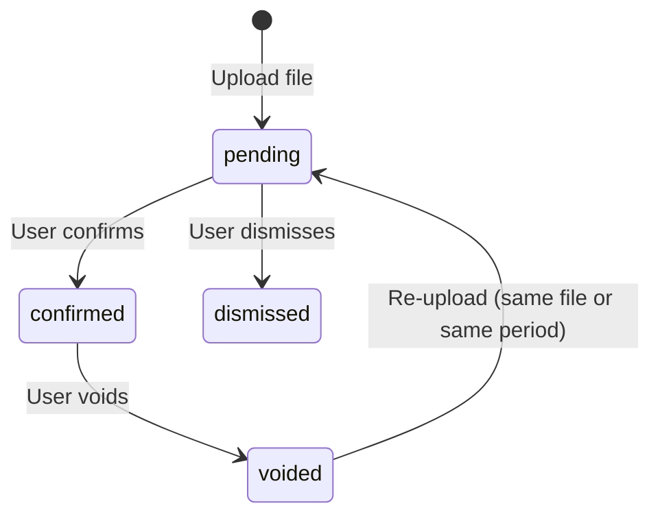

# PM Statement Upload — Hardening Requirements

## Summary

Harden the PM statement upload flow beyond the happy path. The upload lifecycle gains four explicit states and a void-and-re-upload correction model. The primary UX investment is the pre-confirmation review step — AI-suggested categories and full field editing (amount, date, description, category) before anything reaches the ledger. Document type detection (PM statement: monthly vs annual statement) gates a warn-and-skip flow that prevents annual summaries from producing duplicate cashflow entries. Deduplication ships file-hash matching only this iteration; the period + property overlap heuristic is deferred until extraction confidence is measured. Every state change is visible to the user; clarity takes precedence over fewer steps.

---

## Problem Frame

Folio's financial insights and AI assistant depend on accurate ledger data. The current upload flow handles one path — upload, review, confirm — and has no answer for what happens next: a user who confirms a mistake, dismisses an accidental upload, or receives an amended statement from their property manager. For a non-technical investor managing multiple properties across multiple structures, these aren't edge cases; they are routine friction that blocks the app from being useful. Solving data entry quality now unblocks everything built on top of it.

---

## Key Decisions

- **Upload-level void, not period-level void.** Voiding soft-deletes only the transactions linked to a specific upload record. Period-level void — wiping all transactions for a property × month — would silently destroy manual entries and transactions from other document types covering the same period. Too destructive for non-technical users; the mental model is "correct this file," not "clear this month."

- **File-hash dedup only this iteration.** File hash is deterministic and catches exact re-uploads (including file renames). The period + property overlap heuristic — which would catch amended statements arriving with a different fingerprint — is deferred: it requires reliable period extraction, an extraction-confidence threshold, and a property-matching strategy, none of which are measured or defined yet. Until it ships, an amended statement is handled manually: the user locates and voids the original upload, then re-uploads (the F2 flow).

- **Single-transaction corrections via soft-delete + insert.** A confirmed transaction can be corrected — category, amount, date, or description — by soft-deleting the original entry and inserting a corrected row that carries a provenance marker linking it to the original. The ledger stays append-only: rows are never updated in place, and the original remains in the audit trail. Void + re-upload is reserved for whole-statement amendments (a genuinely corrected file from the PM), not single-transaction fixes.

- **Clarity over UX cleverness.** Re-upload warnings about previously deleted transactions are explicit. Extra steps are acceptable when they help a non-technical user understand what is happening.

- **EOFY summaries are warn-and-skip.** Annual statements aggregate transactions and lose per-transaction timing, which is what cashflow tracking needs. The system warns and suggests skipping; the user can override.

- **Void + re-upload is deliberate, not automatic.** The correction flow requires the user to locate and void the original upload before re-uploading a corrected statement. This is more steps than a simple "upload replaces" model, but is necessary because (a) voiding makes explicit which ledger transactions are being removed and (b) an implicit replace could silently delete confirmed data the user did not intend to remove. Planning should validate this flow against real user behaviour before finalising the UX.

---

## Requirements

**Upload lifecycle**

- R1. An upload exists in one of four states: `pending`, `confirmed`, `voided`, or `dismissed`.
- R2. A `pending` upload may be confirmed or dismissed. Dismissal transitions the upload to `dismissed` status and soft-deletes it (sets `deletedAt`). No ledger entries are created. The row is retained so that a dismissed file does not re-trigger the exact-duplicate hash block (R12); only active, non-dismissed uploads are checked.
- R3. A `confirmed` upload may be voided. Voiding soft-deletes all ledger transactions linked to that upload.
- R4. Voiding requires an explicit confirmation step and is not reversible. The confirmation dialog must state: the name and date of the upload being voided, the number of transactions that will be soft-deleted, and that the action cannot be undone. Example: "This will remove 14 transactions imported from March-2025-statement.pdf. This cannot be undone." The dialog must include a Cancel option that abandons the void without making any changes.
- R22. Parse failure and empty results are explicit, terminal outcomes — an upload never sits silently in `pending`. If parsing fails (corrupt file, unsupported layout), the user sees an error naming the file and inviting re-upload. If parsing succeeds with zero transactions, the review screen states that no transactions were found rather than rendering an empty list. Whether parse failure maps to auto-dismissal or a distinct `failed` state is TBD in planning; the requirement is an explicit, user-visible outcome.

**Pre-confirmation review**

- R5. Each parsed transaction is shown with an AI-suggested category pre-filled; the user can change any category before confirming.
- R21. Every field on a staged transaction — amount, date, description, and category — is editable during review. Staged items are not ledger rows, so pre-confirmation edits do not violate append-only. Extends `PATCH /api/v1/ingestion/staged/[id]` to accept amount and date alongside the fields it already accepts. This is the correction path for parser mis-reads: re-uploading the same file cannot fix them, because the same parse is reproduced.
- R6. Transactions with unrecognised types are assigned to "Other expense" or "Other income" based on the transaction's sign (debit vs credit). The upload is not blocked; the user can recategorise before or after confirmation. These catch-all rows must be visually distinguished in the review screen (e.g. warning icon or highlighted row) to prompt the user to review and recategorise before confirming.
- R7. The user can remove any transaction during review; removed transactions are not written to the ledger. The remove action requires no confirmation dialog — the review step itself is the deliberate decision point. If all transactions are removed, the upload is automatically dismissed rather than confirmed — no ledger entries are written and the upload does not block re-uploads of the same file. The remove action must use a distinct label from the post-confirmation delete (R10) — e.g. "Remove from import" (no dialog) vs "Delete transaction" (R10, with re-import warning dialog).
- R8. Confirmation acts on the full current transaction set — all remaining transactions are confirmed together. "All-or-nothing" means the user cannot cherry-pick which transactions to confirm after review; they must either remove unwanted transactions during review (R7) or confirm all of them.

**Post-confirmation transactions**

- R9. A confirmed transaction can be corrected: category, amount, date, and description. Corrections are implemented as soft-delete + insert (never in-place update), with the replacement row carrying a provenance marker (e.g. `superseded_by`) linking it to the original. The UI surface is TBD in planning — candidates include an inline editor in the ledger transaction list or a transaction detail drawer.
- R10. A confirmed transaction can be soft-deleted. The confirmation dialog must state: "Re-uploading the source statement may re-import this transaction."
- R11. Ledger rows are never mutated in place. A correction (R9) always produces a new row and soft-deletes the original, which remains in the audit trail. Void + re-upload (F2) is for whole-statement amendments — a corrected file from the PM — not single-field fixes.

**Deduplication**

- R12. At upload time, if an active (non-voided, non-dismissed) upload with the same file hash exists, the upload is blocked with a message that identifies the existing upload and links to it. The link target is the upload detail or management view (surface TBD in planning — must be resolved alongside the upload management surface decision).
- R13. (Deferred — see Scope Boundaries.) Period + property overlap dedup does not ship this iteration. An amended statement arriving with a different hash is handled manually: the user voids the original upload and re-uploads (F2).
- R14. Re-upload is permitted when the matching upload has been voided or dismissed. The partial unique index (`WHERE deleted_at IS NULL`) excludes both voided and dismissed rows from the uniqueness check.

**Void + re-upload**

- R18. If any transactions were individually soft-deleted by the user from the voided upload, the re-upload review screen must warn: "N transactions were previously deleted from this statement — review before confirming", listing each deleted row's date, amount, and description from the ledger. No matching against the newly staged set is attempted — the user compares and removes rows themselves (R7). Soft-deleted ledger rows must record why they were deleted (e.g. a `deletion_reason` value or `superseded_by` reference): only genuine user deletions trigger this warning; rows soft-deleted as part of a correction (R9) are excluded.

**Document type detection**

- R19. At upload time, the system attempts to classify the document as a periodic PM statement (monthly, fortnightly, or bi-monthly — any cadence that covers a defined period and is suitable for cashflow tracking) or an annual/summary statement (aggregated across multiple periods, not suitable for per-period cashflow tracking). For documents that span multiple periods without being a true annual summary (e.g. a bi-monthly catch-up), the parser should return the full date range (used by the deferred period-overlap check when it ships).
- R20. If the document is classified as an annual or summary statement, the user is warned that it may produce duplicate entries and advised to use monthly statements for accurate cashflow tracking. The user can acknowledge the warning and proceed.

---

## Key Flows

- F1. **Pre-confirmation review**
  - **Trigger:** User uploads a PM statement file.
  - **Steps:** File is parsed → transactions shown with AI-suggested categories → user edits fields (R21), adjusts categories, or removes transactions → user confirms → transactions written to ledger as `confirmed`.
  - **Dismiss path:** User dismisses during review → staged items removed from staging table (no ledger entries exist yet at this point) → upload record soft-deleted as `dismissed` → flow ends.
  - **Covers:** R2, R5, R6, R7, R8, R21, R22

- F2. **Void + re-upload (explicit)**
  - **Trigger:** User navigates to a confirmed upload and initiates void.
  - **Steps:** User confirms void → ledger transactions soft-deleted → user re-uploads same or corrected file → review screen shows any deleted-transaction warning (R18) → user categorises transactions from scratch → user confirms → new transactions written to ledger.
  - **Covers:** R3, R4, R18

- F4. **Post-confirmation single-transaction delete**
  - **Trigger:** User soft-deletes a confirmed transaction.
  - **Steps:** User initiates delete → confirmation dialog shown with re-import warning → user confirms → transaction soft-deleted.
  - **Covers:** R10

---

## Acceptance Examples

- AE1. **Unknown category catch-all**
  - **Covers:** R6
  - **Given:** A parsed transaction has a type not in the pre-defined category list.
  - **When:** The review step is shown.
  - **Then:** The transaction is pre-filled as "Other expense" (debit) or "Other income" (credit). The row is visually highlighted to prompt recategorisation. The upload is not blocked; the user can change the category before confirming.

- AE2. **Remove transactions then confirm**
  - **Covers:** R7, R8
  - **Given:** The parsed statement has 5 transactions; the user removes 2 during review.
  - **When:** The user confirms.
  - **Then:** 3 transactions are written to the ledger. The confirm button or a summary line reflects the remaining count (e.g. "Confirm 3 transactions") so the user can see their removals are reflected before committing.

- AE3. **Re-upload after void — deleted transaction reappears**
  - **Covers:** R10, R18
  - **Given:** Upload X was voided; transaction T2 had been individually soft-deleted before the void.
  - **When:** The same file is re-uploaded and processed.
  - **Then:** T2 reappears in the review step. A warning lists T2's date, amount, and description as previously deleted from this statement, prompting the user to remove it again before confirming.

- AE4. **Conflict detection — same file hash**
  - **Covers:** R12
  - **Given:** "march-statement.pdf" is already uploaded and confirmed.
  - **When:** The user uploads "march-statement-copy.pdf" with the same content (same hash).
  - **Then:** The upload is blocked. The message identifies the existing upload and links to it.

- AE6. **EOFY summary warning**
  - **Covers:** R19, R20
  - **Given:** The user uploads "annual-summary-2025.pdf."
  - **When:** The system classifies it as an annual statement.
  - **Then:** A warning is shown: "Annual summaries may produce duplicate entries — use monthly statements for accurate cashflow tracking." The user can acknowledge and proceed.

- AE7. **Post-confirmation delete — re-import warning shown**
  - **Covers:** R10
  - **Given:** A confirmed transaction from an uploaded statement.
  - **When:** The user initiates soft-delete.
  - **Then:** The confirmation dialog includes: "Re-uploading the source statement may re-import this transaction."

---

## Scope Boundaries

**Deferred for later**
- Period + property overlap dedup (R13) with the guided void-and-replace flows (formerly F3/F5) — deferred until extraction confidence is measured in production. When reintroduced: branch on the matched upload's status (`pending` → offer dismissal per R2; `confirmed` → void per R3/R4); list all overlapping active uploads when more than one matches; exclude uploads confirmed via the R20 annual-statement override from conflict targets (otherwise every monthly upload for a covered year re-fires the warning).
- Bank statement upload hardening — different document type, different dedup and parsing challenges
- AI assistant improvements that depend on PM data quality — downstream of this work
- Manual transaction entry flow
- Multi-property combined PM statements (some PMs send one file covering several properties)

**Out of scope**
- Period-level void (wipe all transactions for a property × month)
- In-place mutation of confirmed ledger rows — corrections happen via soft-delete + insert (R9/R11), never UPDATE
- EOFY summary ingestion as a shortcut for historical onboarding

---

## Dependencies / Assumptions

- The deferred period + property dedup (R13) requires reliable period and property extraction, a minimum extraction-confidence threshold (below which the check is skipped entirely — a false-positive conflict warning is worse than a missed check because it blocks a valid upload), and a property-matching strategy (extracted name/address against the user's property list, or a PM account identifier — especially when one PM manages multiple properties for the same user). These must be defined, and extraction confidence measured in production, before R13 is reintroduced.
- R10 (post-confirmation soft-delete) requires removing or narrowing the existing 403 guard in `app/api/v1/ledger/[id]/route.ts` that blocks soft-delete of any entry linked to a source document. Planning must decide whether to remove the guard, replace it with a softer warning, or introduce a separate endpoint for R10 that bypasses the guard on the existing route.
- Upload-level void (R3/R4) extends the existing `DELETE /api/v1/documents/[id]` route, which already calls `softDeleteDocumentWithEntries` in `lib/ingestion` to soft-delete the source document plus its linked ledger entries in one transaction and returns the deleted-entry count. R4 additionally needs a pre-void count preview (the existing route only reports the count after deletion). Planning must decide how `voided` vs `dismissed` status layers onto this route and whether its best-effort storage-object deletion is retained under the void model — do not spec a parallel void endpoint.
- The void + re-upload correction model assumes the parser reliably extracts transactions from PM statements in use. Planning should audit current extraction failure rates before committing to this UX model — if failure rates are high, the primary friction point is parsing, not the upload lifecycle.
- R14 (re-upload after void) requires a **partial unique index** on `source_documents (user_id, file_hash) WHERE deleted_at IS NULL` rather than the full unique constraint currently in `db/schema.ts`. A full unique constraint keeps soft-deleted rows in scope and will raise a Postgres 23505 error on re-upload of a voided file. Replace `unique().on(t.userId, t.fileHash)` on `sourceDocuments` with ``uniqueIndex('idx_source_documents_user_hash_active').on(t.userId, t.fileHash).where(sql`deleted_at IS NULL`)`` — Drizzle's pg-core index builder supports partial indexes via `.where()`, and `pnpm db:generate` emits the partial index while keeping `db/schema.ts` the source of truth. No raw SQL migration needed.

---

## Outstanding Questions

**Deferred to planning**
- Post-confirmation correction (R9) has no existing endpoint — `PATCH /api/v1/ingestion/staged/[id]` applies to staged items only, before confirmation. Planning must spec the implementation: soft-delete the existing ledger entry and insert the corrected one (category, amount, date, or description), matching the `upsertLoanPaymentEntry` pattern in `lib/property/repositories/ledger.ts`, including the `superseded_by` provenance marker and the deletion-reason discriminator R18 depends on.
- R1 defines four states (`pending`, `confirmed`, `voided`, `dismissed`). Clarify how these map to actual tables: if `pending` state is held in the existing staging_items table, `sourceDocuments` may only need to represent `confirmed` and `voided` (and `dismissed` may be a staging-table soft-delete, not a sourceDocument state at all). Planning should confirm whether a `status` column on `source_documents` is needed, and if so which values it carries.
- How do "Other expense" and "Other income" appear in downstream reports and AI tool responses — are they excluded from cashflow totals, included in their respective expense/income buckets, or flagged as needing resolution? Planning must define the behaviour before implementation begins; a silently omitted category produces wrong totals. This decision also affects what the AI assistant returns when a user asks about their expenses.
