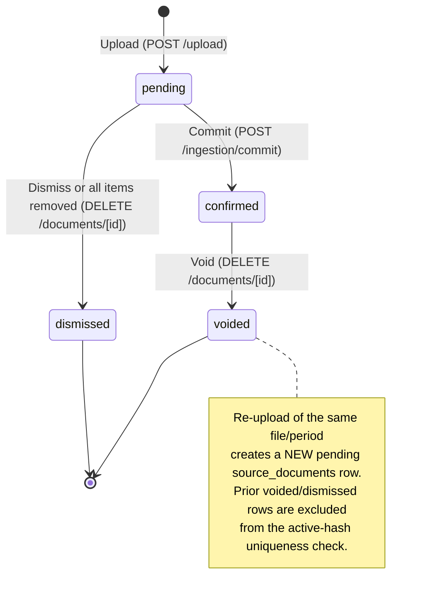
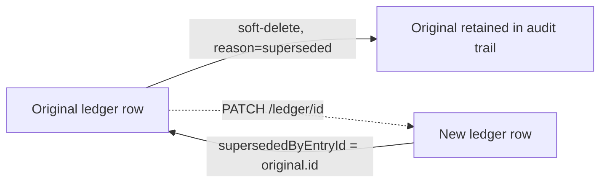

# feat: PM statement upload hardening

## Summary

Extend the existing upload → extract → stage → commit pipeline with an explicit
four-state lifecycle (`pending`/`confirmed`/`voided`/`dismissed`), a void-and-re-upload
correction model, post-confirmation single-transaction correction and delete, full
field editing during pre-confirmation review, and periodic-vs-annual document
detection. Amendments are handled by an explicit Replace action (void-and-restage
anchored to the original) plus a period-grouped uploads view, not by proactive
detection. Deduplication ships file-hash matching only. The work is mostly backend
(schema columns, status-aware routes, deletion provenance) plus targeted review-UI
changes; it reuses existing routes rather than adding parallel ones.

---

## Problem Frame

The current flow only handles the happy path: upload, review, confirm. It has no
answer for what happens after — a user who confirms a mistake, dismisses an accidental
upload, or receives an amended statement. For a non-technical investor managing
several properties, these are routine, not edge cases. Folio's insights and AI
assistant depend on accurate ledger data, so data-entry quality is the unblock for
everything built on top of it. This plan closes the lifecycle gaps and makes every
state change visible to the user, favouring clarity over fewer steps.

---

## High-Level Technical Design

### Upload lifecycle state machine

The four states are backed by an explicit `status` column on `source_documents`
(KTD-1), not derived from `deletedAt` + row presence. `voided → pending` is
conceptual: re-upload creates a **new** `source_documents` row (new id), it does not
mutate the voided row.

### State ↔ storage mapping

| Status | `deletedAt` | Ledger rows | Staging rows | Set by |
|---|---|---|---|---|
| `pending` | null | none | present | upload |
| `confirmed` | null | present (active) | cleared | commit |
| `voided` | set | soft-deleted (`reason='voided'`) | cleared | void |
| `dismissed` | set | none | cleared | dismiss / empty-review |

### Deletion provenance on `property_ledger`

A soft-deleted ledger row records *why* it was deleted via a `deletionReason`
discriminator, which R18's re-upload warning and R9's correction exclusion both read:

- `user_deleted` — a single confirmed transaction the user deleted (R10). **Only these
  fire the R18 re-upload warning.**
- `superseded` — the original row of an R9 correction; the replacement row carries
  `supersededByEntryId` back to it. Excluded from the R18 warning.
- `voided` — bulk soft-delete from a statement void (R3). Excluded from the R18
  warning (these are expected to reappear on re-upload).

### Correction data flow (R9 — append-only preserved)

---

## Key Technical Decisions

- KTD-1. **Explicit `status` enum column on `source_documents`.** Values
  `pending | confirmed | voided | dismissed`. Deriving state from `deletedAt` plus the
  presence of ledger/staging rows is fragile and cannot cleanly distinguish `voided`
  (was confirmed) from `dismissed` (was pending) — both set `deletedAt`. An explicit
  column is the source of truth for the management surface and the R18 lookup.

- KTD-2. **Resolve the ledger DELETE 403 guard for both R9 and R10.** The guard in
  `app/api/v1/ledger/[id]/route.ts` currently blocks soft-delete of any
  source-document-linked entry. Remove it: single delete (R10) is now an explicit,
  warned user action that soft-deletes with `deletionReason='user_deleted'`. Corrections
  (R9) go through `PATCH /api/v1/ledger/[id]`, implemented as soft-delete
  (`reason='superseded'`) + insert of a new row carrying `supersededByEntryId` — the
  ledger stays append-only (conventions §3), never mutated in place.

- KTD-3. **Void deletes the storage object; re-upload tolerates a stale object.** Void
  retains the existing best-effort storage delete. Because `filePath` is deterministic
  by filename with `upsert: false`, a failed best-effort delete would 409 a later
  re-upload. The upload route therefore retries the storage write with `upsert: true`
  when it receives a 409 *after* the active-hash check has already passed (no active
  document with that hash exists → the object is an orphan from a prior void/dismiss).

- KTD-4. **File-hash dedup blocks with an identifying 409.** `findSourceDocumentByHash`
  already filters `isNull(deletedAt)`; combined with the partial unique index (R14) this
  scopes uniqueness to active uploads. On an active-duplicate hit the upload returns
  `409` with the existing upload's id so the client can link to it, replacing today's
  silent `200 { isDuplicate: true }`.

- KTD-5. **`other_expense` / `other_income` are already correctly bucketed.**
  `CATEGORY_BUCKET` maps `other_expense → expense` and `other_income → income`
  (`lib/aggregate/services/compute.ts`), so they are included in cashflow totals, not
  excluded or flagged. No aggregation change is needed. The only gaps are frontend
  (missing `other_income` option; `sessionNetCents` mis-signs income) — see U10. The
  AI-assistant treatment of "Other" categories is deferred (downstream of this work).

- KTD-6. **R6 catch-all is category-based, not signed-amount.** `amountCents` is always
  positive (conventions §9) and the extraction enum already contains `other_expense` /
  `other_income`. R6 is (a) an extraction-prompt instruction to fall back to `other_*`
  for unrecognised line types and (b) a UI highlight of those rows — not a new
  debit/credit column.

- KTD-7. **Void and dismiss share the status-aware `DELETE /api/v1/documents/[id]`
  route.** No parallel void endpoint (per origin dependency note). The handler branches
  on current status: `confirmed → voided` (soft-delete linked ledger with
  `reason='voided'`), `pending → dismissed` (delete staging rows). Pre-void transaction
  count for the R4 dialog comes from a new `GET /api/v1/documents/[id]` returning the
  document plus its active linked-transaction count.

- KTD-8. **Amendments are handled explicitly, not detected.** At ~0.5% of uploads
  (≈2 per 400 observed), proactive amendment detection cannot justify the false-positive
  risk of gating valid uploads — a wrongly-blocked real statement is worse than a missed
  amendment (origin dependency note). Instead: single-line amendments use the R9 correction
  path (do not re-upload); a genuinely re-issued statement uses an explicit **Replace**
  action anchored to the original upload (R23) — it voids the original and stages the new
  file in one step, so intent is unambiguous and dedup is bypassed by construction (the user
  has named the target). Because Replace carries the replaced upload's id, the R18
  previously-deleted warning fires even when the corrected file has a different hash (U8) —
  the hash-only R18 path cannot. A period-grouped uploads view (R24) is the passive backstop
  for accidental duplicates, surfacing overlap where the numbers live rather than blocking at
  upload time.

---

## Requirements

Traceability back to `origin`. R13, R15–R17 are deferred (see Scope Boundaries).

**Upload lifecycle**
- R1. An upload exists in one of four states: `pending`, `confirmed`, `voided`, `dismissed`.
- R2. A `pending` upload may be confirmed or dismissed. Dismissal soft-deletes it and
  creates no ledger entries; the row is retained so it does not re-trigger the hash block.
- R3. A `confirmed` upload may be voided; voiding soft-deletes all linked ledger transactions.
- R4. Voiding requires explicit confirmation stating the upload name/date, the count of
  transactions to be removed, and irreversibility, with a Cancel option.
- R22. Parse failure and empty results are explicit, terminal, user-visible outcomes —
  an upload never sits silently in `pending`.

**Pre-confirmation review**
- R5. Each parsed transaction shows an AI-suggested category, changeable before confirming.
- R21. Every staged field — amount, date, description, category — is editable during review.
- R6. Unrecognised line types fall back to `other_expense`/`other_income`; the upload is
  not blocked; catch-all rows are visually distinguished.
- R7. The user can remove any transaction during review (no dialog); if all are removed the
  upload is auto-dismissed. The remove label is distinct from the post-confirmation delete.
- R8. Confirmation acts on the full current transaction set (all-or-nothing).

**Post-confirmation transactions**
- R9. A confirmed transaction can be corrected (category, amount, date, description) via
  soft-delete + insert with a `supersededByEntryId` provenance marker.
- R10. A confirmed transaction can be soft-deleted, with a re-import warning dialog.
- R11. Ledger rows are never mutated in place.

**Deduplication**
- R12. At upload time an active same-hash upload blocks the upload with a message
  identifying and linking to the existing upload.
- R14. Re-upload is permitted once the matching upload is voided or dismissed, via a
  partial unique index (`WHERE deleted_at IS NULL`).

**Void + re-upload**
- R18. If the user individually deleted transactions from a since-voided upload, the
  re-upload review screen warns and lists each previously-deleted row's date, amount, and
  description. Only genuine user deletions (`deletionReason='user_deleted'`) trigger this.

**Document type detection**
- R19. At upload time, classify the document as a periodic PM statement or an
  annual/summary statement; return the full date range for multi-period documents.
- R20. An annual/summary classification warns the user about duplicate entries and advises
  monthly statements; the user can acknowledge and proceed.

**Amendment & management surface** (introduced in planning — see KTD-8)
- R23. From a `confirmed` upload the user can **Replace** it with a corrected file: the
  action voids the original (R3) and starts a new `pending` upload linked to it, in one
  guided step. No proactive duplicate detection; intent is explicit. Single-line amendments
  use R9 instead.
- R24. The uploads management view groups uploads by property × period so that two active
  uploads covering the same period are visible at a glance — the passive backstop for
  accidental duplicates and amended re-uploads.

---

## Scope Boundaries

**Deferred for later**
- Period + property overlap dedup (R13) and its guided void-and-replace flows — deferred
  until extraction confidence is measured in production.
- Bank statement upload hardening.
- AI assistant handling of "Other" categories and AI improvements dependent on PM data quality.
- Manual transaction entry flow.
- Multi-property combined PM statements.
- Normalised run-rate cashflow and a recurring lumpy-cost model (e.g. land tax,
  directly-paid insurance) that PM statements structurally omit. Land tax in particular
  is an **entity-level** cost, not property-level, which complicates the data model —
  deferred to a separate feature. Until then the cash-basis run-rate omits these costs and
  reads high for land-tax payers; this is a known, accepted gap. (Insurance paid *through*
  the PM already appears in statements and is captured; only directly-paid insurance is
  affected.)

**Outside this product's identity**
- Period-level void (wiping all transactions for a property × month).
- In-place mutation of confirmed ledger rows.
- EOFY / annual-summary ingestion as an input — neither for historical onboarding nor for
  seeding recurring lumpy costs. Annual summaries lose per-transaction timing; recent PM
  statements are the superior source. Annual documents are **detected and warned**
  (R19/R20, U4), not ingested.

**Deferred to follow-up work**
- Backfill of `status` for existing `source_documents` beyond the migration default (see U1).

---

## Implementation Units

### U1. Schema: lifecycle status + deletion provenance

- **Goal:** Add the columns and index the whole lifecycle depends on.
- **Requirements:** R1, R9, R10, R14, R18, R23.
- **Dependencies:** none.
- **Files:** `db/schema.ts`; generated migration under `drizzle/`;
  `__tests__/api/documents.integration.test.ts` (extend).
- **Approach:**
  - Add `sourceDocumentStatusEnum` (`pending`, `confirmed`, `voided`, `dismissed`) and a
    `status` column on `source_documents`, `notNull().default('pending')`.
  - Replace `unique().on(t.userId, t.fileHash)` with
    `uniqueIndex('idx_source_documents_user_hash_active').on(t.userId, t.fileHash).where(sql`deleted_at IS NULL`)`.
  - Add `ledgerDeletionReasonEnum` (`user_deleted`, `superseded`, `voided`) and nullable
    `deletionReason` on `property_ledger`; add nullable `supersededByEntryId` uuid
    self-reference (`property_ledger.id`, `onDelete: 'set null'`). Watch the 63-char FK
    name limit (conventions §4) — supply an explicit name via `foreignKey()` if needed.
  - Add nullable `replacesSourceDocumentId` uuid self-reference on `source_documents`
    (`source_documents.id`, `onDelete: 'set null'`) recording which confirmed upload a
    Replace (R23) supersedes; the R18 lookup reads it so an amended file with a different
    hash still surfaces previously-deleted rows. Same 63-char FK-name caution.
  - Migration default sets all existing rows to `pending`; note in verification that a
    follow-up backfill (deferred) will reconcile historical confirmed/voided rows.
  - Run `pnpm db:generate` then `pnpm db:migrate` (never `push`; never edit `_journal.json`).
- **Patterns to follow:** existing enum + `pgTable` definitions in `db/schema.ts`; RLS
  auto-enable trigger already covers new columns (no new table).
- **Test scenarios:**
  - Integration: insert a soft-deleted (`deletedAt` set) row with hash H, then insert an
    active row with the same `(userId, H)` — succeeds (partial index excludes the deleted row).
  - Integration: two active rows with the same `(userId, H)` — second raises 23505.
  - Test expectation: schema/type compile verified by `pnpm tsc --noEmit`; behavioral
    coverage via the two integration cases above.
- **Verification:** `pnpm db:migrate` applies clean on a fresh `pnpm db:reset`; `tsc` passes.

### U2. Upload: identifying dedup block + re-upload storage tolerance

- **Goal:** R12 blocking behaviour and R14 re-upload robustness; set `status='pending'`.
- **Requirements:** R12, R14, R1, R23.
- **Dependencies:** U1.
- **Files:** `app/api/v1/upload/route.ts`; `lib/ingestion/repositories/documents.ts`
  (insert path sets status implicitly via default); `__tests__/api/upload.test.ts`,
  `__tests__/api/upload.integration.test.ts`.
- **Approach:**
  - On an active-hash hit, return `409` `{ error, existingUploadId }` (identifies + links)
    instead of `200 { isDuplicate: true }`.
  - When the storage write returns 409 *after* the active-hash check passed, retry once
    with `upsert: true` (orphaned object from a prior void whose best-effort delete failed —
    KTD-3), then proceed to insert.
  - Keep the post-insert 23505 race branch; on race, return the same 409 identifying shape.
  - Accept an optional `replacesSourceDocumentId`; validate it references a caller-owned
    upload (else 400/404) and persist it on the new `pending` row. This is what the R23
    Replace flow sets and what U8 reads to fire the R18 warning across a changed hash.
- **Patterns to follow:** existing `getStorageStatusCode` handling; `StorageApiError`
  uses `.statusCode` string (CLAUDE.md gotcha).
- **Test scenarios:**
  - Unit: active duplicate → 409 with `existingUploadId`.
  - Unit: 401 when unauthenticated; 400 for bearer auth; 413 over size; 400 non-PDF (regression).
  - Unit: storage-write 409 after passing hash check → retries with `upsert: true` then 201.
  - Unit: `replacesSourceDocumentId` for a caller-owned upload → persisted on the new row;
    an id owned by another user → 404 (cross-user isolation).
  - Integration: upload file, void it, re-upload the same file → 201 (new pending row).
  - Integration: upload the same active file twice → second returns 409.
- **Verification:** pre-commit hook green; re-upload-after-void succeeds end to end.

### U3. Extract: zero-transaction success, catch-all categories, period range

- **Goal:** R22 empty-result path, R6 catch-all fallback, R19 date-range return.
- **Requirements:** R22, R6, R19.
- **Dependencies:** U1.
- **Files:** `lib/ingestion/extraction/schema.ts`,
  `lib/ingestion/extraction/parse.ts`, `app/api/v1/extract/route.ts`,
  `lib/ingestion/services/ingestion.ts`; `__tests__/api/extract.test.ts`.
- **Approach:**
  - Relax `extractionResultSchema.lineItems` from `.min(1)` to `.min(0)` so a valid
    zero-transaction extraction no longer throws → 500.
  - Extract route returns success with `stagedCount: 0` for the empty case (no error).
  - Update the PM extraction system prompt to map unrecognised debit/credit line types to
    `other_expense` / `other_income` respectively (KTD-6) rather than dropping them.
  - Persist the extracted statement period onto `source_documents.periodStart/periodEnd`
    (already-present nullable columns) for the deferred R13 check.
- **Patterns to follow:** `loanExtractionResultSchema` already uses `.min(0)`; existing
  `updateSourceDocumentType` write pattern for persisting doc-level fields.
- **Test scenarios:**
  - Unit: extraction with zero line items → 200 `{ stagedCount: 0 }`, no throw.
  - Unit: extraction with an unrecognised line → staged as `other_expense`/`other_income`.
  - Unit: parse failure (scanned/image-only) still returns the existing 400 (regression).
  - Unit: period start/end persisted to the source document.
- **Verification:** pre-commit hook green; empty statement produces an empty review, not an error.

### U4. Classification: periodic vs annual + warn path

- **Goal:** R19 periodic-vs-annual dimension and R20 warn-and-proceed.
- **Requirements:** R19, R20.
- **Dependencies:** U3.
- **Files:** `lib/ingestion/extraction/schema.ts`,
  `lib/ingestion/extraction/parse.ts`, `app/api/v1/extract/route.ts`;
  `__tests__/api/extract.test.ts`.
- **Approach:**
  - Extend `classificationResultSchema` with a `statementScope` field
    (`periodic` | `annual_summary`) independent of the pm/loan `documentType`.
  - Update the classifier prompt to set the new dimension.
  - When `statementScope === 'annual_summary'`, the extract route returns a warn signal in
    its response (e.g. `{ ..., warning: 'annual_summary' }`) — staging still proceeds so the
    user can acknowledge and continue (R20); it does not block.
- **Patterns to follow:** existing `classifyDocument` + `updateSourceDocumentType` flow;
  the "skip classification if already typed" short-circuit in the extract route.
- **Test scenarios:**
  - Unit: annual-summary classification → response carries the warn signal; items still staged.
  - Unit: periodic classification → no warn signal (regression on the happy path).
  - Unit: multi-period non-annual doc → full date range returned (feeds U3 persistence).
- **Verification:** pre-commit hook green.

### U5. Commit: set confirmed status; auto-dismiss on empty

- **Goal:** R8 all-or-nothing confirm sets `status='confirmed'`; R7 auto-dismiss when nothing commits.
- **Requirements:** R8, R7, R1.
- **Dependencies:** U1.
- **Files:** `lib/ingestion/services/ingestion.ts`, `app/api/v1/ingestion/commit/route.ts`;
  `__tests__/api/ingestion-commit.test.ts`.
- **Approach:**
  - In `commitStagedItems`, within the existing transaction, set each committed
    document's `status='confirmed'`.
  - If a document has zero committable approved items, set `status='dismissed'` +
    `deletedAt` instead of leaving it `pending` (R7 all-removed case), and clear its staging.
- **Patterns to follow:** the existing `commitStagedItems` transaction (soft-delete prior
  ledger → insert → clean staging); extend inside the same `db.transaction`.
- **Test scenarios:**
  - Unit: commit with N approved items → ledger rows created; document `confirmed`.
  - Unit: commit where a document has zero committable items → document `dismissed`, no ledger rows.
  - Integration: after commit, the document's active status is `confirmed` and staging is empty.
- **Verification:** pre-commit hook green.

### U6. Void + dismiss via status-aware document DELETE; pre-void count

- **Goal:** R2/R3 transitions and the R4 confirmation preview.
- **Requirements:** R2, R3, R4, R1.
- **Dependencies:** U1, U5.
- **Files:** `app/api/v1/documents/[id]/route.ts` (add `GET`; branch `DELETE`),
  `lib/ingestion/repositories/documents.ts` (extend `softDeleteDocumentWithEntries` to
  set status + `deletionReason='voided'`; add a dismiss path + a count query);
  `__tests__/api/documents-id.test.ts`, `__tests__/api/documents.integration.test.ts`.
- **Approach:**
  - `GET /api/v1/documents/[id]` returns the document plus `activeTransactionCount`
    (count of linked, non-deleted ledger rows) for the R4 dialog.
  - `DELETE` branches on current status: `confirmed → voided` (soft-delete linked ledger
    with `deletionReason='voided'`, set `status='voided'` + `deletedAt`, best-effort storage
    delete retained per KTD-3); `pending → dismissed` (delete staging rows, set
    `status='dismissed'` + `deletedAt`, no ledger touched).
  - Return the affected count so the client can confirm what happened.
- **Patterns to follow:** existing `softDeleteDocumentWithEntries` transaction; existing
  best-effort storage delete in the DELETE route.
- **Test scenarios:**
  - Unit: `GET` returns document + accurate `activeTransactionCount`; 404 for another user's id.
  - Unit: `DELETE` on confirmed → voided, ledger soft-deleted; `DELETE` on pending →
    dismissed, staging cleared, ledger untouched.
  - Unit: 401 unauthenticated; 400 invalid UUID; 404 not found / not owned.
  - Integration: void a confirmed upload → its ledger rows no longer returned by ledger
    queries and carry `deletionReason='voided'`; the document is excluded from the active hash check.
  - Integration: dismiss a pending upload → excluded from active hash check; no ledger rows created.
- **Verification:** pre-commit hook green; void and dismiss both leave the file re-uploadable.

### U7. Post-confirmation single delete + correction; resolve 403 guard

- **Goal:** R10 delete and R9/R11 correction on confirmed transactions.
- **Requirements:** R9, R10, R11.
- **Dependencies:** U1.
- **Files:** `app/api/v1/ledger/[id]/route.ts` (remove 403 guard from `DELETE`; add `PATCH`),
  `lib/aggregate/repositories/ledger.ts` (add correction repo fn; set
  `deletionReason='user_deleted'` on delete), `lib/openapi/spec.ts` (document the
  bearer-accessible ledger `DELETE`/`PATCH`); `__tests__/api/ledger-id.test.ts`.
- **Approach:**
  - `DELETE`: remove the `sourceDocumentId !== null` 403 guard (KTD-2); soft-delete with
    `deletionReason='user_deleted'`.
  - `PATCH /api/v1/ledger/[id]`: Zod body accepting any of `category`, `amountCents`,
    `lineItemDate`, `description`; implement as soft-delete of the original
    (`deletionReason='superseded'`) + insert of a new row carrying `supersededByEntryId`
    = original id, in one transaction; return the new row. Ledger stays append-only (R11).
  - Update the OpenAPI spec first (spec-first, conventions §5) for both verbs.
- **Patterns to follow:** `upsertLoanPaymentEntry` in `lib/property/repositories/ledger.ts`
  (soft-delete + insert in a transaction) is the reference for the correction repo fn.
- **Test scenarios:**
  - Unit: `DELETE` on a source-doc-linked entry now succeeds (no 403) and sets `user_deleted`.
  - Unit: `PATCH` produces a new row, soft-deletes the original with `superseded`, links
    `supersededByEntryId`; returns the new row; response shape matches the spec.
  - Unit: `PATCH`/`DELETE` 401 unauthenticated; 404 for another user's entry (cross-user isolation).
  - Integration: after a correction, the original is absent from active ledger queries and
    the new row reflects the edited field; after a delete, the entry is absent and marked `user_deleted`.
- **Verification:** pre-commit hook green; spec regenerates without error.

### U8. Re-upload deleted-transaction warning (R18)

- **Goal:** Warn on re-upload when the user had individually deleted rows from a since-voided upload.
- **Requirements:** R18, R23.
- **Dependencies:** U1, U2, U6, U7.
- **Files:** new query in `lib/ingestion/repositories/documents.ts` (or a small service in
  `lib/ingestion/services/`), surfaced through the staged-listing response consumed by the
  review screen; `__tests__/api/ingestion-staged.test.ts` (or a dedicated test).
- **Approach:**
  - On staging a re-upload, resolve the prior upload two ways: (a) an explicit
    `replacesSourceDocumentId` link from a Replace (R23) — authoritative, works across a
    changed hash; (b) fallback to prior `source_documents` rows for the same
    `(userId, fileHash)` that are `voided`/`dismissed`. Then fetch their `property_ledger`
    rows with `deletionReason='user_deleted'`.
  - Return those rows' date, amount, and description as a `previouslyDeleted` warning list
    attached to the staged session. No matching against the newly staged set (R18) — the
    user compares and removes rows themselves via R7.
- **Patterns to follow:** `listStagedBySourceDocumentIds` grouping; `groupStagedItemsByDocument`.
- **Test scenarios:**
  - Integration: delete T2 from a confirmed upload, void it, re-upload the same file →
    the staged session carries a `previouslyDeleted` entry for T2 (date/amount/description).
  - Integration: rows soft-deleted by the void itself (`voided`) are NOT listed.
  - Integration: rows soft-deleted by a correction (`superseded`) are NOT listed.
  - Integration: a re-upload with no prior user deletions carries an empty warning list.
  - Integration: Replace a confirmed upload with a *different-hash* file carrying
    `replacesSourceDocumentId` → the prior `user_deleted` row is still listed (the link
    resolves across the changed hash where the hash fallback would not).
- **Verification:** pre-commit hook green.

### U9. Staged item full-field editing + remove semantics

- **Goal:** R21 amount/date editing; R7 remove-from-import backend.
- **Requirements:** R21, R7.
- **Dependencies:** U1.
- **Files:** `app/api/v1/ingestion/staged/[id]/route.ts`,
  `lib/ingestion/repositories/staging.ts`; `__tests__/api/ingestion-staged.test.ts`.
- **Approach:**
  - Extend the staged `PATCH` Zod schema and `patchStagedItem` to accept `amountCents`
    (positive int) and `lineItemDate` (YYYY-MM-DD) alongside the existing fields. Staged
    items are not ledger rows, so pre-confirmation edits do not violate append-only (R21).
  - Support removal: a staged item removed during review is deleted (not committed). Keep
    the existing `DELETE`/reject mechanism or add one if absent; the API contract for
    "remove" must be distinct from the post-confirmation ledger delete (U7).
- **Patterns to follow:** the existing staged `PATCH` handler and `patchStagedItem`;
  the `DATE_REGEX` and positive-int validation already in the extraction schema.
- **Test scenarios:**
  - Unit: `PATCH` with `amountCents` and `lineItemDate` persists and returns the updated item.
  - Unit: invalid amount (≤0) or malformed date → 400.
  - Unit: 401 unauthenticated; 404 for another user's staged item.
  - Unit: removing the last staged item on a document triggers the U5 auto-dismiss path.
- **Verification:** pre-commit hook green.

### U10. Review UI: field editing, catch-all highlight, empty state, confirm count

- **Goal:** R5/R6/R7/R8/R21/R22 review-screen behaviours.
- **Requirements:** R5, R6, R7, R8, R21, R22.
- **Dependencies:** U3, U4, U9.
- **Files:** `app/(app)/upload/page.tsx` (and any extracted review components).
- **Approach:**
  - Add `other_income` to `CATEGORY_OPTIONS` (currently stops at `loan_payment`) so R6's
    credit catch-all is selectable.
  - Fix `sessionNetCents`: income categories (`rent`, `other_income`) add, expenses
    subtract — mirror `CATEGORY_BUCKET` rather than treating only `rent` as income.
  - Make amount, date, and description editable inline (R21); persist via the U9 `PATCH`.
    Follow the bulk-PATCH partial-failure learning: refresh server state in every error
    branch (`docs/solutions/logic-errors/bulk-patch-partial-failure-...`).
  - Visually distinguish `other_expense`/`other_income` rows (warning icon/highlight, R6).
  - "Remove from import" (no dialog, R7) distinct from the post-confirmation "Delete
    transaction" (U11). Render the zero-transaction message when a session has no items (R22).
  - Reflect the remaining count on the confirm control (e.g. "Confirm 3 transactions", AE2).
  - Show the annual-summary warning (R20) when the extract response carries the warn signal.
- **Patterns to follow:** existing review sections and `handlePatchItem`; existing toast +
  `loadStaged` refresh cycle.
- **Test scenarios:** Test expectation: none (components have no unit coverage — CLAUDE.md).
  Verify via `pnpm dev` + browser: edit amount/date/category and confirm the committed
  ledger reflects edits; remove all items → auto-dismiss; catch-all rows highlighted;
  empty statement shows the no-transactions message; annual upload shows the warning.
- **Verification:** browser golden-path + the listed edge cases (frontend has no test gate).

### U11. Post-confirmation & management UI: void/dismiss/correct/delete + R18 warning

- **Goal:** R4 dialog, R9/R10 surfaces, R12 link target, R18 warning display.
- **Requirements:** R4, R9, R10, R12, R18.
- **Dependencies:** U6, U7, U8.
- **Files:** `app/(app)/upload/page.tsx` and/or a new uploads-management view + a ledger
  transaction edit/delete surface (component location per existing app structure).
- **Approach:**
  - Void confirmation dialog (R4): fetch `GET /api/v1/documents/[id]` for the count, state
    name/date/count and irreversibility, with Cancel.
  - Post-confirmation delete dialog (R10) with the "Re-uploading the source statement may
    re-import this transaction" copy; distinct label/flow from review-time remove.
  - Correction surface (R9): inline editor or detail drawer that calls the U7 `PATCH`.
  - A management/detail view for uploads so the R12 409 block can link to the existing
    upload (the block's link target).
  - Render the R18 `previouslyDeleted` warning list on the re-upload review screen.
- **Patterns to follow:** existing dialog/toast patterns; existing upload page state model.
- **Test scenarios:** Test expectation: none (components have no unit coverage). Verify via
  browser: void shows the accurate count and removes transactions; delete shows the
  re-import warning; correction produces a new value while insights recompute; re-upload
  after a prior user deletion shows the R18 warning; the 409 duplicate block links to the
  existing upload.
- **Verification:** browser golden-path + edge cases.

### U12. Amendment via Replace + period-grouped uploads view

- **Goal:** R23 explicit Replace flow and R24 period grouping in the management view.
- **Requirements:** R23, R24.
- **Dependencies:** U2, U6, U8, U11.
- **Files:** the uploads-management view from U11 (`app/(app)/upload/page.tsx` and/or the new
  management view). No new endpoints — composes the existing void (U6) and upload (U2) calls.
- **Approach:**
  - On a `confirmed` upload, add a **"Replace with corrected version"** action: run the R4
    void confirmation (reusing the U6 count preview), void the original on confirm, then open
    the file picker and upload the new file with `replacesSourceDocumentId` set to the voided
    upload's id (U2). The resulting review screen shows the R18 previously-deleted warning
    (U8) — reliable even for a different-hash corrected file.
  - Guidance copy on the correction/void surfaces: for a single wrong line, point the user to
    the R9 inline correction (U7/U11), not Replace — Replace is for a re-issued whole
    statement (KTD-8).
  - Group the uploads list by property × period using `periodStart/periodEnd` (persisted in
    U3): render uploads under their property, ordered by period, and flag when two *active*
    uploads cover the same period so an accidental duplicate is visible at a glance (R24).
- **Patterns to follow:** the U6 void dialog and the U2 upload call; existing list/grouping
  patterns in the app.
- **Test scenarios:** Test expectation: none (components have no unit coverage — CLAUDE.md).
  Verify via browser: Replace a confirmed statement → original voided, corrected file staged,
  R18 warning shown for a previously-deleted row even when the new file's hash differs; two
  active uploads for the same property × period are visibly flagged in the list.
- **Verification:** browser golden-path + edge cases (frontend has no test gate).

---

## Risks & Dependencies

- **Migration ordering (U1).** New enums + partial index must land before any route change
  reads `status`. Run `pnpm db:generate`/`pnpm db:migrate`; never `push`; never hand-edit
  `_journal.json` (CLAUDE.md). Verify on a fresh `pnpm db:reset`.
- **Storage-object orphaning (KTD-3).** Void's storage delete is best-effort; the
  `upsert:true`-on-409 retry (U2) is the safety net. If both the delete and the retry path
  regress, re-upload of a voided file would 409 — covered by a U2 integration test.
- **Extraction quality precedes the UX model.** The void-and-re-upload model assumes the
  parser reliably extracts PM statements. Origin flags auditing current failure rates before
  over-investing; if failure rates are high the friction is parsing, not the lifecycle. This
  plan does not measure that — treat it as an assumption to validate in production.
- **Contract change on upload dedup (U2).** Moving from `200 { isDuplicate }` to `409`
  changes the client contract; U10/U11 must handle the new shape (regression risk if the
  frontend still reads `isDuplicate`).
- **Cross-user isolation (U2, U6, U7).** New `GET /documents/[id]`, ledger `PATCH`, the R18
  lookup, and the upload route's `replacesSourceDocumentId` all take/return IDs — each must
  scope by `userId` in the WHERE clause (a Replace must never link to another user's upload);
  covered by the per-unit isolation tests (testing-strategy §5).

---

## Acceptance Examples

Carried from origin; each maps to unit test scenarios above.

- AE1. Unrecognised line type → pre-filled `other_expense`/`other_income`, row highlighted,
  upload not blocked (R6 → U3, U10).
- AE2. 5 parsed, 2 removed, confirm → 3 written; confirm control shows the remaining count
  (R7, R8 → U5, U9, U10).
- AE3. Voided upload where T2 was individually deleted; re-upload → T2 reappears and is
  listed as previously deleted (R10, R18 → U7, U8, U11).
- AE4. Same-hash re-upload of an active confirmed file → blocked, message identifies and
  links the existing upload (R12 → U2, U11).
- AE6. Annual-summary upload → duplicate-entries warning, user can acknowledge and proceed
  (R19, R20 → U4, U10).
- AE7. Post-confirmation delete → dialog includes the re-import warning (R10 → U7, U11).
- AE8. PM re-issues a corrected statement → user picks Replace on the original confirmed
  upload → original voided, corrected file staged, and any previously-deleted row is surfaced
  by the R18 warning despite the new file's different hash (R23, R18 → U2, U8, U12).

---

## Sources / Research

- Upload/extract/stage/commit pipeline: `app/api/v1/upload/route.ts`,
  `app/api/v1/extract/route.ts`, `lib/ingestion/services/ingestion.ts`,
  `app/api/v1/ingestion/commit/route.ts`.
- Dedup + soft-delete repo: `lib/ingestion/repositories/documents.ts`
  (`findSourceDocumentByHash` already filters `isNull(deletedAt)`;
  `softDeleteDocumentWithEntries` is the void base).
- 403 guard to resolve: `app/api/v1/ledger/[id]/route.ts:30-35`.
- Correction pattern reference: `upsertLoanPaymentEntry` in
  `lib/property/repositories/ledger.ts`.
- Category bucketing (KTD-5): `CATEGORY_BUCKET` in `lib/aggregate/services/compute.ts:3-14`.
- Extraction schema constraints (KTD-6, R22): `lib/ingestion/extraction/schema.ts:53-58`
  (`lineItems.min(1)`), `amountCents` positive-only.
- Frontend gaps: `app/(app)/upload/page.tsx` (`CATEGORY_OPTIONS` missing `other_income`;
  `sessionNetCents` mis-signs income).
- Partial-failure learning: `docs/solutions/logic-errors/bulk-patch-partial-failure-client-state-divergence-2026-05-29.md`.
- Schema conventions: `db/schema.ts`; `docs/conventions.md` §3 (ledger append-only), §4 (RLS, FK 63-char limit), §5 (spec-first).
